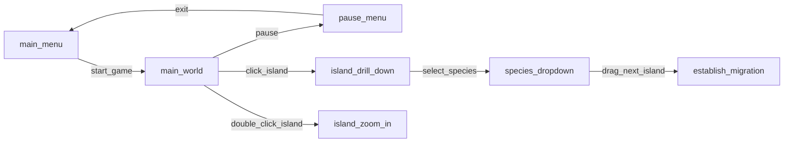

eco
===

## Game Overview

### Core Concept

Design ecosystems and spread over the archipelago. A real world dynamics species game.

### Unique Selling Points

The game models real-world population dynamics and offers a thousand species. Establish parasitic, symbiotic
or predator-prey relationships between species to bring stability to your ecosystem. Spontanious mutations and
artificial ones fine tune the species for survival in the clash of ecosystems.
Natural disasters and invaders can be assimilated or bring to extinction.

### Genre

Simulation. Strategy.

### Target Audience

Sim players. Biologist enthusiast. Paradox-like player.
Adult. Erudite. Scientific.

### Platforms

Web and desktop

## Story

### Plot Summary

An established ecosystem gains the ability to migrate. In the process it will meet other ecosystems
and tune its stats to survive in a world full of threats and challenges.

## Branching / Player Choices

Welcome new species or banish them. Research evolution traits. Save or rescue lost species. Risk
adquiring an evolutive trait or gain a reward (science points).

## Characters

Species Elders. Each species genus will have an Elder you can interact with that will give you information
about the status of its genus.

### Protagonists

Your ecosystem genus elders.

Gaia (world disasters and other worldwide events)

### Antagonists

Other ecosystems genus elders.

## Setting

The Galapagos Archipelago or an equivalent setting.

### World History and Lore

Darwin's observation of the adaptations of the species was key in the writing of the theory of evolution.
Later improved by Bookchin's Mutual Aid and lots of follow up scientific literature.

## Gameplay

### Core Gameplay Loop

#### Inland

Tweak a trait observe the consequences.

Tweak traits and help dying species when seasons or major disasters occur.

Acquire science points and unlock new species / trait development.

#### Ausland exploration

Move a number of individuals to another island and observe the consequences.

Become an established ecosystem in other islands. Fight or cooperate with other ecosystems for
survival and "island hegemony" which grants "legislative" powers over the island.

### Mechanics and Features

#### General world equations

Species interactions modeled by General Lotka-Volterra model per island, meaning a NxN matrix noting the
impact of one species onto another. Each ecotick the new population will be computed.

An ecotick is a ~5 second tick between population change iterations.

The growth rate will be capped to a certain range to avoid singularities. When the density reaches a
lower threshold the species will be considered extinct.

The maximum density will also be capped to avoid population explosions on ill-defined mutuality matrices.
They're ill-defined because one species should always have a negative mutuality with itself; the more
members we have the less "space" there is. (debatable if we could make this density dependant)

The player can run "prediction" which will compute K iterations of the model and output a result:
Ecosystem death, species death, high volatility population, low volatility population with max and mins of
each species population density in the last ecoticks.

#### Species definition

Each species has a population density $d^i$, a self-reproduction rate $r \propto d^i$ and a mutuality vector
$w^i \propto d^{ij}$. At each ecotick, the new population is computed like so $d^i_{t+1} = r \cdot d^i_t + w^i \cdot d^{ij}_t$ for each $i \in N$ where $N$ is the number of species.

If a species is splitting up into two species, the density will be reported as one but computed as a separate species the moment it appears. And report the distribution %. (debatable if we need the distinction)

##### Seasons and world events impacts

Each species needs a medium: sea, water, land, forest, desert. The seasons impact some mediums more than
others, and so do the world events.
This means that each species needs season variants. They could just be "virtual" species in the mutuality matrix. As seasons change, the values gradually change to those of the season.

#### Traits

##### Creative mode

The player can change the mutuality matrix between species at will.

##### Specialist mode

A trait change towards specialization with towards one species lowers the impact of other genus species.

New species are unlocked by science points.

#### Seasons

Each season changes the mutuality matrix of each species. Either gradually or immidiatally as season changes (to be decided). In practice it means that predation and reproduction rates of non-season species
go down by a lot, keeping population stable or slowly declining.

#### World disasters

World disasters can instantly kill a chunk of population. There have to be things in place to prevent
extinction events like this. We generally prefer extinction by non-adaptation.

World events can change the mutuality matrix or reproduction rates by changing the climate or whatever.
E.g. droughts will reduce the reproduction rate of water animals.

#### Migrations

The player can select one island and another and establish migration routes with density to substract
from the original island.
It can be a one-time event, continuous or seasonal migration.

#### AI ecosystems

Non player ecosystems will either be resident in some islands or activelly play as the character would,
mutating and emigrating to new islands.

### Controls

#### World map

An archipelago map with a dozen islands. Each island has colored pixels denoting the densities of each
species. We could split by trophic chain steps to avoid making apex predators invisible since they'll have
a small population. E.g. one pixel per unit where unit is individuals per square kilometer also
interpretable as percentatge of area with that species. This one pixel per unit could change depending
on the trophic level, for plants could be one, for herbivores five for carnivores 15. The trophic level
can possibly be determined dynamically by identifying the first layer (that can survive on its own),
and classifying up.

The player couls also speed up the eco tick to move the simulation faster.

#### Traits

In the first iteration, traits can be changed at will. So a one could click on a pixel to get the species,
or pop a menu to select one species and tweak the mutuality matrix. If there are too many species we could add a filter (e.g. filter non mutual species should be enough)

Traits can at first be directly numbers in the mutuality matrix and later on could be "packs" of mutuality
changes. Meaning that you can develop the "slow" trait and this translates internally to higher reproductive
rates, less mutual interference and higher predation of fast predators.

We think predicting the consequences of trait modification is hard enough to let the player tweak the
numbers directly, even if it can be artistically displayed differently.

Later the player will have evolution points, which will let him specialize one species to gain benefit
from one specific species or type of species at a loss of generalization. Basically the player must choose
between specializing or generalizing. Something that also happens naturally via game mechanic by which
as one species heads towards extinction it gains resistance against the main predators at a loss of
resistance against the lesser predators. Or, on the opposite scenario, in an abundance of resources,
efficiency is lost. These mechanics have been observed in nature.

#### Migration

To establish migrations the player clicks one island and it's target. Then chooses species, amount and
rate. The migrations routes are curved arrows from one island to another and can be hidden.

### Objectives

#### Short Term Goals

##### Inland

Survive in the first island, unlock a new species or evolve into a new species.

Survive the whole year (seasons).

Survive a world event.

##### Ausland exploration

Colonize a new island and develop an stable ecosystem there.

#### Long Term Goals

Have thriving cyclical ecosystem with many species (in the order of hundreds) that can resist
world events.

Establish presence in all islands or cooperative relationships with AI ecosystems.

### Progression Systems

#### Ecosystem leveling

By surviving and world events/disasters, the player gets science points which can be spent to unlock a
new species or evolve a trait.

#### Unlockable Abilities

"Legislation" on islands can be passed to favor or disfavor a genus or set artificial growth caps.

### Failure States and Conditions

The Game is lost when all your ecosystems are extinct.

## Art and Sound

### Art style

The Art style will be quite sober. Essentially a pixel archipelago which will change colors
as species density changes. The base color depends on the trophic layer and genus.

* Watery types -> pastel blue
* Land Hervibores -> pastel green
* Predators -> pastel red
* Invader -> bright red

#### Visual References / Inspiration

Stellaris, that little ant game or vegetable garden game.

#### Color Palette

Pastel palette as starter, npc ecosystems will be more electric.

#### Character Designs

The elders are antropomorphic animals, insects, plants. For example in anime style with a few emotions, interacted via dialogic.

#### Environment Aesthetics

Sober. At the moment the islands will not be zoomable. Maybe at a later date.
So the environment is basicly the world view and the elder interactions, which will look like species interactions of stellaris but via dialogic or something like that.

### Sound

#### Musical Style

Ambiental. Dreamy music with natural sounds. Or we could go for a Frostpunk epic music style.

#### Themes/Motifs

#### Sound Effects

Events notification:

- Species extinction
- Season change (natural sounds)
- Ecosystem clash

## Level Design

### Level Structure and Flow

We'll start with a fixed world and at a later time a procedural island distribution for the world.

Each island stats will be fixed and later will be different having an impact on the reproduction rate
and the mutuality matrix.

### Objectives within levels

Establish estable relationships with N > 3 species.

We'll set a few milestones (might be hidden?)

### Environmental Hazards/Obstacles

Survive the seasons.

### Level Progression and Pacing

After each milestone new species and hazards become available/possible.

## User Interface (UI)

### Menus

### HUD

Total species and its density

Species densities per island?

Each island colored by occupancy per species

    :rocket: code hint
    use set_pixel() to paint a texture over the island texture to denote population densities.

## Technical Requirements

### Game Engine

Godot.

### Hardware requirements

Desktop, web and tablet.

### Thirdparty

Kenney tilesets for the islands?

Some cartoon filter for the animal's elders and icons. We might use emojis as icons.

## Fears, Risks and Caveats

### Too much chaos

The General Lotka Volterra equations are chaotic for more than 3 species, meaning that no
human can predict how a change will impact the overall equilibrium. There's the risk that
the player sticks to simple 3-fold relationships. So strong many-to-many connections will
be rewarded.

## Game Code Draft

A singleton GLVdata will contain the N densities of the species as an array and the mutuality matrix.
The NxN mutuality matrix in godot will be coded as a dictionary of arrays.

A singleton GLV will contain the GLV functions.

To be able to parallelize the GLV, the D' historic of densities will be stored in an array of arrays.
